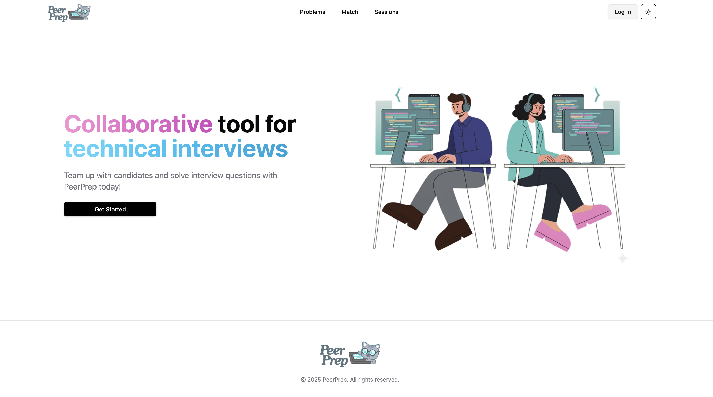
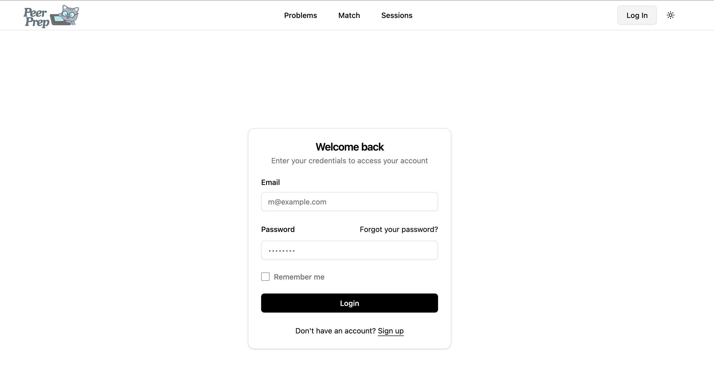
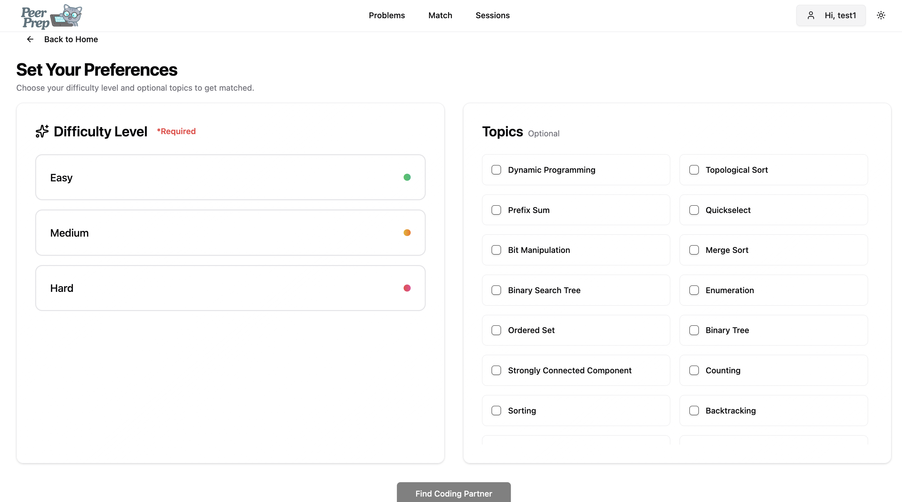
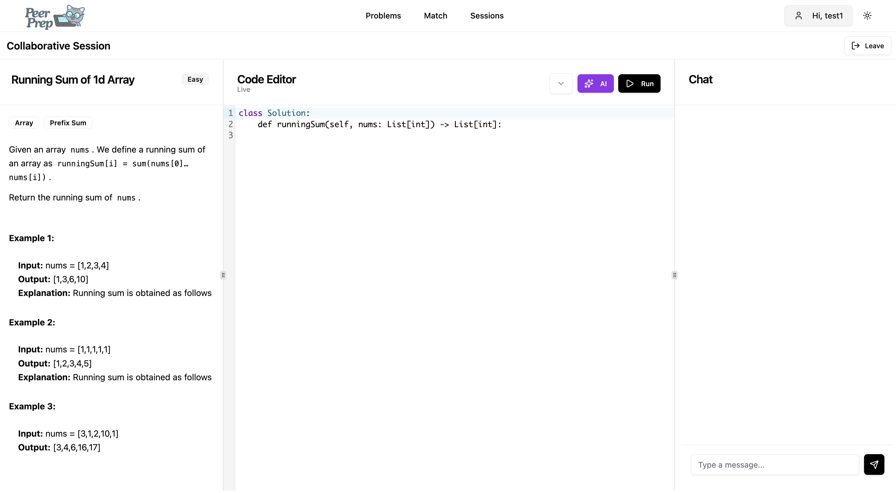

[](https://classroom.github.com/a/QUdQy4ix)

# CS3219 Project (PeerPrep) - AY2526S1

## Group: G05

### Note:

- You are required to develop individual microservices within separate folders within this repository.
- The teaching team should be given access to the repositories as we may require viewing the history of the repository in case of any disputes or disagreements.


# Table of Contents
- [1. Product Overview](#1-product-overview)
- [2. Project Architecture](#2-project-architecture)
- [3. Pre-requisites](#3-pre-requisites)
- [4. Installation & Setup](#4-installation-and-setup)

# 1. Product Overview
## 1.1 Key Features
- Real-time Matchmaking: Users are matched instantly based on chosen difficulty and topics.
- Collaborative Code Editor: Synchronous, low-latency coding environment.

## 1.2 Product Visualizations





# 2. Project Architecture
PeerPrep is implemented using a Microservices Architecture to ensure scalability and separation of concerns.
| Service | Role | Tech Stack | Port |
| --- | --- | --- | --- |
| API Gateway (Nginx) | Routing and Load Balancing | Nginx | 80 |
| User Service | Authentication and User Profiles Management | Node/Express, MongoDB | 4001 |
| Question Service | Question Repository and Fetching | Node/Express, MongoDB | 4002 |
| Matching Service | Queueing, Matchmaking, SSE/WebSockets | Node/Express, Redis | 4003 |
| Collaboration Service | Real-time Code Editing and Chatting | Node/Socket.io, Redis | 4004 |

# 3. Pre-requisites
You must have the following installed to run the project locally:
- [Docker Desktop](https://www.docker.com/products/docker-desktop/) (Required for all services and databases)
- `node 22.19.0 (LTS)`
- `pnpm` (Recommended package manager for monorepo workspaces)

# 4. Installation and Setup
## 4.1 Clone Repository and Install Dependencies for Frontend and Backend
```bash
# Clone the repository
git clone https://github.com/CS3219-AY2526Sem1/cs3219-ay2526s1-project-g05.git peerprep
cd peerprep

# Install pnpm dependencies across all microservices
cd frontend && pnpm install && cd -
cd backend && pnpm -r install && cp .env.example .env && cd -
```

## 4.2 Setup Docker Containers
This command will set up the foundational database containers (MongoDB and Redis).
```bash
docker-compose -f docker-compose-local.yml up -d
```
- This sets up only MongoDB, for now

# AI Use Summary

Tools: ChatGPT (GPT‑5 Thinking), GitHub Copilot
Prohibited phases avoided: requirements elicitation; architecture/design decisions.
Allowed uses:

- Generated JSDoc comment headers for type definitions for Swagger Docs

Verification: All AI outputs reviewed, edited, and tested by the authors.
Prompts/Key Exchanges: See /ai/usage-log.md at the end of this segment.
